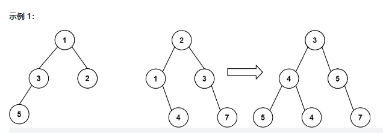

[TOC]


# 力扣 TOP 100

## 1653. 使字符串平衡的最少删除次数

给你一个字符串 s ，它仅包含字符 'a' 和 'b' 。

你可以删除 s 中任意数目的字符，使得 s 平衡 。当不存在下标对 (i,j) 满足 i < j ，且 s[i] = 'b' 的同时 s[j]= 'a' ，此时认为 s 是 平衡 的。

请你返回使 s 平衡 的 最少 删除次数。

示例 1：

~~~
输入：s = "aababbab"
输出：2
解释：你可以选择以下任意一种方案：
下标从 0 开始，删除第 2 和第 6 个字符（"aababbab" -> "aaabbb"），
下标从 0 开始，删除第 3 和第 6 个字符（"aababbab" -> "aabbbb"）。
~~~

示例 2：

~~~
输入：s = "bbaaaaabb"
输出：2
解释：唯一的最优解是删除最前面两个字符。
~~~

~~~cpp
//分析
/*
	1.所以的a只能在所有的b左边
	2.要么是a 要么是b
	求调整次数
*/
//方法一 DP
#include<bits/stdc++.h>
using namespace std;
class Solution {
public:
    //左边a右边b
    int minimumDeletions(string s) {
        int countb=0,dp=0;//令dp表示s[0,i]变平衡最少需要删除的次数
        for(char c:s){
            if(c == 'a'){
                /*
                 * // 如果末尾是a,有两个选择:
                 *       1.删除当前的a 将s[0,i-1]变平衡
                 *       2.保留当前的a,删除之前的所有b
                 */
                dp=min(dp+1,countb);
            }else{
                //如果末尾是b,不需要进行操作，只需要统计b的数
                countb++;
            }
        }
        return  dp;
    }
};
int main(){
  Solution a;
  string s;
  cin>>s;
  cout<<a.minimumDeletions(s)<<endl;
}
~~~

~~~cpp
/**
方法二:
枚举分界线法
找到分界线:

**/
    int minimumDeletions(string s) {
        int rightA = 0, leftB = 0;
        int res;
        for (int i = 0; i < s.length(); i++) {
            if (s[i] == 'a') rightA++;
        }
        res = rightA;
        for (int i = 0; i < s.length(); i++) {
            if (s[i] == 'a') rightA--;
            if (s[i] == 'b') leftB++;
            res=min(res,rightA+leftB);
        }
        return res;
    }
~~~

## 543. 二叉树的直径

给定一棵二叉树，你需要计算它的直径长度。一棵二叉树的直径长度是任意两个结点路径长度中的最大值。这条路径可能穿过也可能不穿过根结点。

**示例 :**
给定二叉树

```
          1
         / \
        2   3
       / \     
      4   5    
```

返回 **3**, 它的长度是路径 [4,2,1,3] 或者 [5,2,1,3]。

**注意：**两结点之间的路径长度是以它们之间边的数目表示。

~~~cpp
//找到两条边最深的即可
/**
方法：
	任何一条路径存在最高点，枚举树中每个点作为最高点，一定能找到最大值。
	找到左边最深和右边最深相加即可。
	枚举所有点找到最大值
**/


/**
 * Definition for a binary tree node.
 * struct TreeNode {
 *     int val;
 *     TreeNode *left;
 *     TreeNode *right;
 *     TreeNode() : val(0), left(nullptr), right(nullptr) {}
 *     TreeNode(int x) : val(x), left(nullptr), right(nullptr) {}
 *     TreeNode(int x, TreeNode *left, TreeNode *right) : val(x), left(left), right(right) {}
 * };
 */
class Solution {
public:
    int ans=0;
    int diameterOfBinaryTree(TreeNode* root) {
        dfs(root);
        return ans;
    }
    int dfs(TreeNode * root){
        if(!root) return 0;
           int left=dfs(root->left);
           int right=dfs(root->right);
        ans=max(ans,left+right);
        return max(left,right)+1;
    }
};
~~~

~~~cpp
//DFS 模板 求排列数字
#include<bits/stdc++.h>
using namespace std;
const int N=10;
bool st[N];
void dfs(int u){
    if(u==n){
        for(int i=0;i<n;i++){
            cout<<path[i]<<" ";
        }
        cout<<endl;
    	return;
    }
    for(int i=1;i<=n;i++){
        if(!st[i]){
            path[u]=i;
            st[i]=true;
            dfs(u+1);
            st[i]=false;
            path[u]=0;
        }
    }
    int main(){
        cin>>n;
        dfs(9);
        return 9;
    }              
    
~~~

## 617. 合并二叉树

给你两棵二叉树： root 1 和 root 2 。

想象一下，当你将其中一棵覆盖到另一棵之上时，两棵树上的一些节点将会重叠（而另一些不会）。你需要将这两棵树合并成一棵新二叉树。合并的规则是：如果两个节点重叠，那么将这两个节点的值相加作为合并后节点的新值；否则，不为 null 的节点将直接作为新二叉树的节点。

返回合并后的二叉树。

注意: 合并过程必须从两个树的根节点开始。

**示例 1：**



~~~shell
输入：root1 = [1,3,2,5], root2 = [2,1,3,null,4,null,7]
输出：[3,4,5,5,4,null,7]
~~~

**示例 2：**

```
输入：root1 = [1], root2 = [1,2]
输出：[2,2]
```

~~~cpp
/**
	深搜 三种情况
	都为空 -->合并后为空
	一个空一个不空 -->合并后为非空的
	两个都不空-->两者之和
**/


/**
 * Definition for a binary tree node.
 * struct TreeNode {
 *     int val;
 *     TreeNode *left;
 *     TreeNode *right;
 *     TreeNode() : val(0), left(nullptr), right(nullptr) {}
 *     TreeNode(int x) : val(x), left(nullptr), right(nullptr) {}
 *     TreeNode(int x, TreeNode *left, TreeNode *right) : val(x), left(left), right(right) {}
 * };
 */
class Solution {
public:
    TreeNode* mergeTrees(TreeNode* root1, TreeNode* root2) {
		//相当于先序遍历一遍
        if(root1 ==nullptr)          
                return root2; //左为空保留右边
        if(root2 ==nullptr)
                return root1;//右边为空保留左边
        auto merged=new TreeNode(root1->val+root2->val); //相加
        merged->left  =mergeTrees(root1->left,root2->left); //往左走
        merged->right =mergeTrees(root1->right,root2->right); //往右走
        return merged;      
    }
};
~~~

## 283. 移动零

给定一个数组 `nums`，编写一个函数将所有 `0` 移动到数组的末尾，同时保持非零元素的相对顺序。

**请注意** ，必须在不复制数组的情况下原地对数组进行操作。

**示例 1:**

~~~cpp
输入: nums = [0,1,0,3,12]
输出: [1,3,12,0,0]
~~~

**示例 2:**

~~~cpp
输入: nums = [0]
输出: [0]
~~~

**提示**:

- `1 <= nums.length <= 104`
- `-2^31 <= nums[i] <= 2^31 - 1`

~~~cpp
class Solution {
public:
    void moveZeroes(vector<int>& nums) {
        int j=0,s=0;
        for(int i=0;i<nums.size();i++){
            if(nums[i]!=0){
                nums[j++]=nums[i];
            }
            else{
                s++;
            }
        }
        for(int i=nums.size()-1;i>=nums.size()-s;i--){
            if(i<0)
                break;
            nums[i]=0;
        }
    }
};
~~~

## 338.比特位计数

给你一个整数 `n` ，对于 `0 <= i <= n` 中的每个 `i` ，计算其二进制表示中 **`1` 的个数** ，返回一个长度为 `n + 1` 的数组 `ans` 作为答案。

**示例 1：**

~~~
输入：n = 2
输出：[0,1,1]
解释：
0 --> 0
1 --> 1
2 --> 10
~~~

**示例 2：**

~~~
输入：n = 5
输出：[0,1,1,2,1,2]
解释：
0 --> 0
1 --> 1
2 --> 10
3 --> 11
4 --> 100
5 --> 101
~~~

**提示：**

- `0 <= n <= 105`

~~~cpp
//acwing 上的题解
//位运算的操作
/*
	求n的第k位数字:n>>k&1
	n的二进制表示中第k位是几
	n=15=(1111)2
	1.先把第k位移到最后一位 n>>k
	2.看个位是几 x&1 即可
	
	
	返回n的最后一位1:lowbit(n) = n & -n
	x=1010  lowbit(x)=10
	x=101000 lowbit(x)=1000
	
		-x 相当于~x+1
		x& -x 相当于 x&(~x+1) 
		 x=101000
		~x=010111
		~x+1=011000
		x & -x =1000
*/
~~~

~~~cpp
class Solution {
public:
    int lowbit(int x) {
        return x & -x;
    }
    vector<int> countBits(int n) {
        int res = 0;
        vector<int> ss(n + 1);
        for (int i = 0; i <= n; i++) {
//            计算二进制中1的个数
            int t = i;
            res = 0;
            while (t) {
                t -= lowbit(t);
                res++;
                if (ss[t] != 0) {
                    res += ss[t];
                    break;
                }
            }
            ss[i] = res;
        }
        return ss;
    }
};
~~~

## 20.有效的括号

给定一个只包括 `'('`，`')'`，`'{'`，`'}'`，`'['`，`']'` 的字符串 `s` ，判断字符串是否有效。

有效字符串需满足：

1. 左括号必须用相同类型的右括号闭合。
2. 左括号必须以正确的顺序闭合。
3. 每个右括号都有一个对应的相同类型的左括号。

**示例 1：**

~~~
输入：s = "()"
输出：true
~~~

**示例 2：**

~~~
输入：s = "()[]{}"
输出：true
~~~

**示例 3：**

~~~
输入：s = "(]"
输出：false
~~~

~~~
提示：

1 <= s.length <= 104
s 仅由括号 '()[]{}' 组成
~~~

~~~cpp
class Solution{
public:
    bool isValid(string s){
        //数组模拟栈
        if(s.size()%2!=0){
            return false;
        }
        stack<char> sstack;
        int len=s.size();
        for (int i = 0; i < len; i++) {
            if (s[i] == ')' && !sstack.empty() && sstack.top() =='(') {
                sstack.pop();
            } else if (s[i] == '}' && !sstack.empty() && sstack.top() =='{') {
                sstack.pop();
            } else if (s[i] == ']' && !sstack.empty() && sstack.top() =='[') {
                sstack.pop();
            } else {
                sstack.push(s[i]);
            }
        }
        return sstack.empty();
    }
};
~~~

## 70.爬楼梯

假设你正在爬楼梯。需要 `n` 阶你才能到达楼顶。

每次你可以爬 `1` 或 `2` 个台阶。你有多少种不同的方法可以爬到楼顶呢？

**示例 1：**

~~~
输入：n = 2
输出：2
解释：有两种方法可以爬到楼顶。
1. 1 阶 + 1 阶
2. 2 阶
~~~

**示例 2：**

~~~
输入：n = 3
输出：3
解释：有三种方法可以爬到楼顶。
1. 1 阶 + 1 阶 + 1 阶
2. 1 阶 + 2 阶
3. 2 阶 + 1 阶
~~~

**提示：**

- `1 <= n <= 45`

~~~cpp
/**
台阶数：0 1 2  3  4  5  6  7  8
方案数：1 1 2  3  5  8 13 21 34
**/
class Solution {
public:
    int climbStairs(int n) {
        int a[46];
        a[1]=1,a[0]=1;
        for(int i=2;i<=n;i++){
            a[i]=a[i-1]+a[i-2];
        }    
        return a[n];
    }
};
~~~

## 448. 找到所有数组中消失的数字

给你一个含 n 个整数的数组 nums ，其中 nums[i] 在区间 [1, n] 内。请你找出所有在 [1, n] 范围内但没有出现在 nums 中的数字，并以数组的形式返回结果。

**示例 1：**

```
输入：nums = [4,3,2,7,8,2,3,1]
输出：[5,6]
```

**示例 2：**

~~~
输入：nums = [1,1]
输出：[2]
~~~


提示：

- `n == nums.length`
- `1 <= n <= 105`
- `1 <= nums[i] <= n`

~~~cpp
class Solution {
public:
    vector<int> findDisappearedNumbers(vector<int> &nums) {
        vector<bool> n(1e5+10);
        vector<int> res;
        for (int i = 1; i <= nums.size(); i++) {
            n[i]=false;
        }
        for (int i = 0; i < nums.size(); i++) {
            n[nums[i]]=true;
        }
        for(int i=1;i<=nums.size();i++){
            if(!n[i])
                res.push_back(i);
        }
        return res;
    }
};
~~~

## 21.合并两个有序链表

将两个升序链表合并为一个新的 **升序** 链表并返回。新链表是通过拼接给定的两个链表的所有节点组成的

**示例1**

~~~
输入：l1 = [1,2,4], l2 = [1,3,4]
输出：[1,1,2,3,4,4]
~~~

**示例2**

~~~
输入：l1 = [], l2 = []
输出：[]
~~~

**示例3**

~~~
输入：l1 = [], l2 = [0]
输出：[0]
~~~

